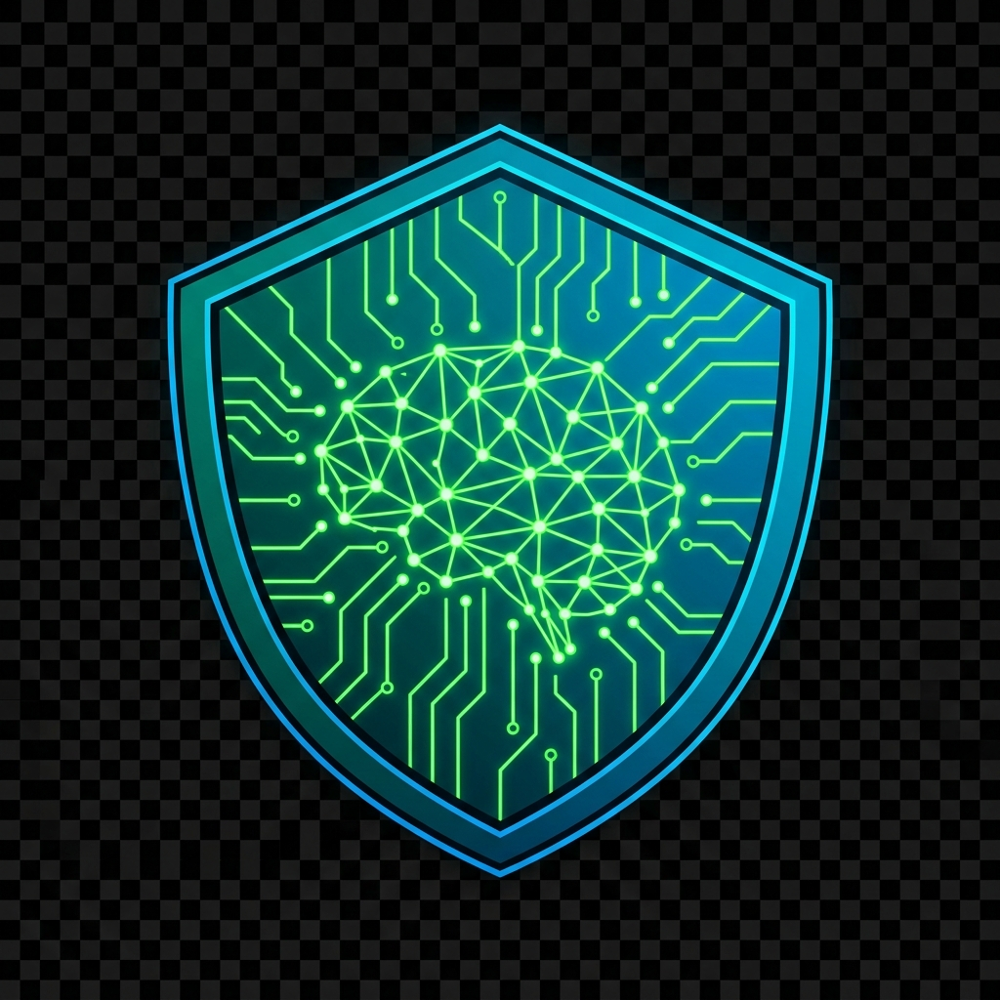

<div align="center">
  
  
  # CyberEdu AI 🛡️
  
  **Next-Generation Cybersecurity Assistant & Educational Platform**
  
  [](https://www.python.org)
  [](https://streamlit.io)
  [](https://groq.com)
  [](LICENSE)
</div>

---

## 📖 Overview

**CyberEdu AI** is a highly advanced, intelligent cybersecurity platform designed to simulate elite security environments and act as a personalized AI mentor. Powered by **LLaMA-3** (via the lightning-fast **Groq** Inference Engine) and integrated with **Tavily AI** for real-time web context, it delivers professional-grade insights for Red Teaming, Blue Teaming, and SOC Operations.

The user interface has been heavily modified and customized to deliver a premium, minimalist, "ChatGPT-style" dark mode experience—completely abstracting away the default Streamlit UI constraints.

## 🚀 Key Features

- **Multi-Persona Intelligence**: Instantly switch between custom AI personalities:
  - 🔴 **Red Team Analyst**: Offensive security, payload creation, and penetration testing methodologies.
  - 🔵 **Blue Team Analyst**: Defensive engineering, zero-trust architecture, and incident response.
  - 🟢 **SOC Engineer**: Log analysis, threat hunting, and SIEM/SOAR playbooks.
- **Real-Time Cyber Search**: Integrated `TavilyClient` to retrieve the latest CVEs, vulnerability disclosures, and security news dynamically.
- **Persistent Conversational Memory**: A robust SQLite/PostgreSQL backend that logs and retains chat histories across user sessions.
- **Custom Authentication Engine**: Secure, role-based JWT access control utilizing `bcrypt` password hashing.
- **Admin Command Center**: Exclusive telemetry dashboard for administrators to monitor user queries, view application usage, and manage access.
- **Premium UI/UX**: Handcrafted CSS overrides to enforce a flawless, minimalist Dark Mode, utilizing native SVG rendering and smooth transitions.

---

## 🛠️ Architecture & Tech Stack

| Component | Technology |
|---|---|
| **Frontend UI** | Streamlit (Customized CSS Engine) |
| **LLM Engine** | Groq API (`llama-3.3-70b-versatile`) |
| **Search/RAG** | Tavily Search API |
| **Database** | SQLite (Production-ready for PostgreSQL / Neon.tech) |
| **Authentication** | PyJWT, bcrypt |

## ⚙️ Installation & Local Setup

### 1. Clone the Repository
```bash
git clone https://github.com/Alouakhalid/cyberbot.git
cd cyberbot
```

### 2. Install Dependencies
```bash
pip install -r requirements.txt
```

### 3. Environment Variables
You must set up your secure API keys. Create a `.streamlit/secrets.toml` file in the root directory:

```toml
JWT_SECRET          = "your_secure_random_string_here"
TAVILY_API_KEY      = "tvly-your_tavily_key"
GROQ_API_KEY        = "gsk_your_groq_key"
ADMIN_USERNAME      = "admin"
ADMIN_PASSWORD      = "your_secure_admin_password"
```
*(Never commit this file to GitHub!)*

### 4. Run the Application
```bash
streamlit run app.py
```

## ☁️ Deployment (Streamlit Cloud)
This application is fully optimized for **Streamlit Cloud** deployment:
1. Connect this GitHub repository to Streamlit Cloud.
2. Set the **Main file path** to `app.py`.
3. In the Streamlit deployment dashboard, go to **Advanced Settings -> Secrets** and paste the contents of your `secrets.toml`.
4. Deploy!

## 🔐 Security Notice
This application handles simulated offensive cybersecurity techniques. It is built strictly for **educational and defensive purposes**. The developers assume no liability for misuse of the provided knowledge or generated code.

---
*Built by [Ali Khalid](https://github.com/Alouakhalid)*
